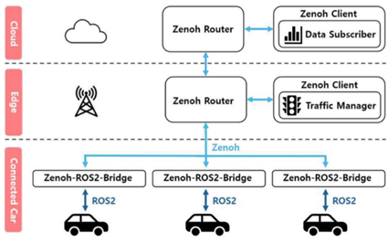
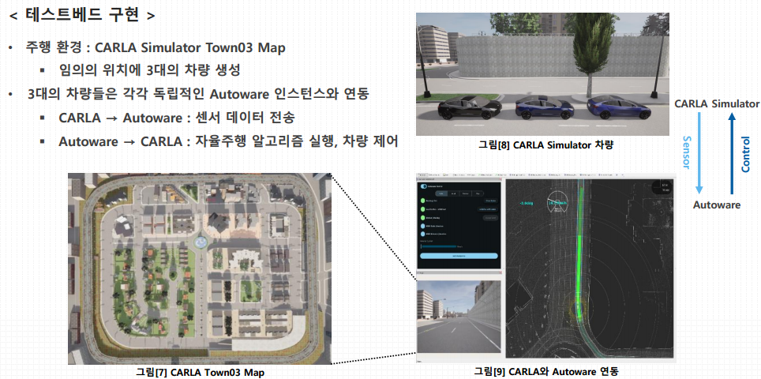
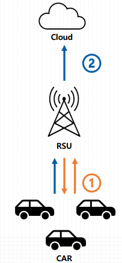
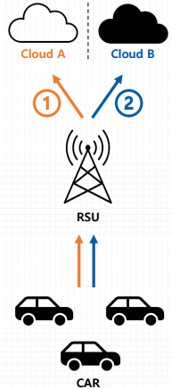

# 2025-ITS
한국 ITS 학회 2025 춘계학술대회 논문

---

## 📌 논문/프로젝트 소개

본 저장소는 *커넥티드 자율주행을 위한 Zenoh 기반 V2X 통신 테스트베드 구축*을 목표로 진행된 연구 및 개발 내용을 담고 있습니다.  
이 프로젝트는 기존 DDS, MQTT 기반 V2X 미들웨어의 한계를 극복하고,  
분산형 P2P 방식의 Zenoh 미들웨어를 활용해 **실시간성**과 **확장성**을 동시에 만족시키는  
V2X 통신 플랫폼을 구현하고 성능을 검증하였습니다.

---

## 🎯 연구 목적

- Zenoh의 P2P 기반 구조를 활용하여, 브로커 없이 차량–엣지–클라우드 간 통신을 직접 수행
- CARLA + Autoware 연동을 통한 가상 자율주행 환경에서의 테스트
- 실시간 메시지(안전 메시지 포함)의 전송 안정성 및 지연시간 검증
- 다양한 시나리오에서의 확장성 및 적용 가능성 평가

---

## 🗺️ Zenoh 기반 V2X 통신 SW 아키텍처



---

## 🚗 테스트베드 환경 사진



---

## 📊 실험 결과 그래프 1



---

## 📊 실험 결과 그래프 2




## 🛠️ 아키텍처

```plaintext
Connected Car
   └─ CARLA Simulator (센서/주행 데이터)
   └─ Autoware (자율주행 알고리즘)
   └─ Zenoh-ROS2 Bridge
   ↓
Edge (RSU)
   └─ Zenoh Router
   └─ Traffic Manager
   ↓
Cloud (AWS EC2)
   └─ Zenoh Client
   └─ Data Subscriber
